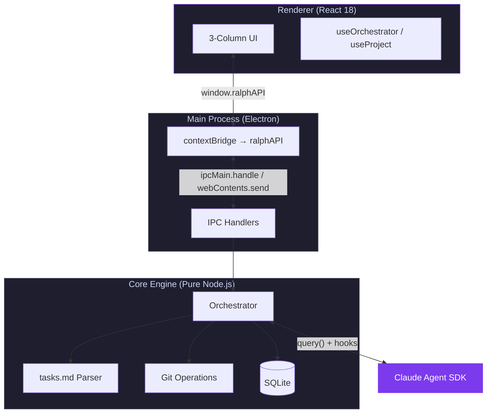

# Ralph Claude

<p align="center">
  
</p>

<p align="center">
  <strong>Orchestrate fresh Claude Code instances per spec-kit phase — clean context, full visibility.</strong>
</p>

<p align="center">
  
  
  
  
</p>

---

Ralph Claude is an Electron desktop app that automates feature implementation using the [Claude Agent SDK](https://docs.anthropic.com/en/docs/agents-and-tools/claude-agent-sdk) and [spec-kit](https://github.com/anthropics/claude-code/tree/main/skills). It spawns a fresh Claude Code agent per **phase** of work — each with clean context to prevent token bloat — while streaming every tool call, subagent spawn, and thinking step to a real-time trace UI.

## Features

- **Phase-level orchestration** — parses `tasks.md` specs into phases and spawns one agent per phase, keeping context focused
- **Real-time agent trace** — streams tool calls, thinking blocks, subagent activity, and results as they happen with GSAP-animated timeline
- **Spec-kit integration** — discovers specs in `specs/` or `.specify/specs/`, uses `/speckit-plan` and `/speckit-implement` skills
- **Git automation** — creates branches, commits per phase, and opens PRs with cost/duration metrics
- **Execution history** — persists all runs, phases, steps, and subagent metadata to SQLite for replay and analysis
- **Frameless desktop UI** — custom title bar, 3-column layout (sidebar → task board → agent trace), Catppuccin-inspired dark theme

## Architecture



**Data flow:** User action → React UI → IPC → Core orchestrator → Claude Agent SDK → hooks capture steps → IPC events → React hooks → UI updates (real-time streaming).

## Quick Start

### Prerequisites

- **Node.js** >= 18
- **Claude Code CLI** installed and authenticated
- **GitHub CLI** (`gh`) for PR creation

### Installation

```bash
git clone https://github.com/lukaskellerstein/ralph-claude.git
cd ralph-claude
npm install
```

### Development

```bash
./dev-setup.sh
```

This starts the Vite dev server (port 5500) and launches Electron with hot reload. Logs go to `/tmp/ralph-claude-logs/`.

### Production Build

```bash
npm run build:start
```

## Usage

1. **Open a project** — click the folder icon to select a directory containing spec-kit specs
2. **Select a spec** — the overview shows all discovered specs with phase/task counts
3. **Start a run** — choose plan or build mode; the orchestrator begins phase-by-phase execution
4. **Watch the trace** — tool calls, thinking blocks, and subagent activity stream in real-time
5. **Review the PR** — on completion, a PR is created with commit history and cost metrics

## Configuration

| Setting | Description | Default |
|---------|-------------|---------|
| `mode` | `plan` (spec planning) or `build` (implementation) | `build` |
| `model` | Claude model to use | SDK default |
| `maxTurns` | Max agent turns per phase | `200` |
| `phases` | `"all"` or specific phase numbers `[1, 3]` | `"all"` |

## Project Structure

```
ralph-claude/
├── src/
│   ├── main/               # Electron main process
│   │   ├── index.ts        # App lifecycle, BrowserWindow, IPC
│   │   ├── preload.ts      # contextBridge → window.ralphAPI
│   │   └── ipc/            # Handler modules (orchestrator, project, history)
│   ├── core/               # Orchestration engine (pure Node.js, no Electron imports)
│   │   ├── orchestrator.ts # Phase loop, agent spawning, event emission
│   │   ├── parser.ts       # tasks.md → Phase[] with Task[]
│   │   ├── git.ts          # Branch creation, PR generation
│   │   ├── database.ts     # SQLite schema & queries (runs, traces, steps)
│   │   └── types.ts        # Shared interfaces (Phase, Task, AgentStep, etc.)
│   └── renderer/           # React 18 UI
│       ├── App.tsx          # Root component, view switching
│       ├── hooks/           # useOrchestrator, useProject
│       ├── components/
│       │   ├── layout/      # AppShell, Topbar, WindowControls
│       │   ├── project-overview/  # Spec cards grid
│       │   ├── task-board/  # Phase/task views, progress bar
│       │   └── agent-trace/ # Step timeline, tool cards, subagent pills
│       └── styles/          # Catppuccin-inspired CSS custom properties
├── tests/                   # Diagnostic scripts
├── docs/                    # Logo assets
├── dev-setup.sh             # Development environment bootstrap
├── vite.config.ts           # Vite config (renderer build)
├── tsconfig.json            # TypeScript (main + core)
└── package.json
```

## Tech Stack

| Layer | Technology |
|-------|-----------|
| Desktop | Electron 30 (frameless BrowserWindow) |
| UI | React 18, CSS Custom Properties, GSAP, Lucide React |
| Engine | Pure Node.js orchestrator, Claude Agent SDK |
| Data | better-sqlite3 (execution history) |
| Build | Vite, TypeScript (strict mode) |
| Git | GitHub CLI (`gh`) for automated PRs |

## Contributing

1. Fork the repository
2. Create your feature branch (`git checkout -b feature/amazing-feature`)
3. Commit your changes (`git commit -m 'Add amazing feature'`)
4. Push to the branch (`git push origin feature/amazing-feature`)
5. Open a Pull Request

