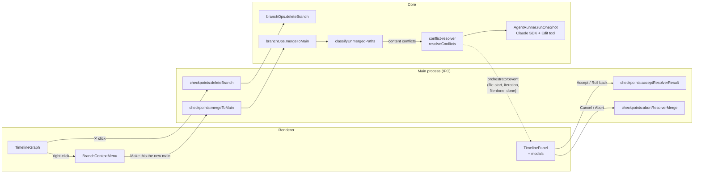
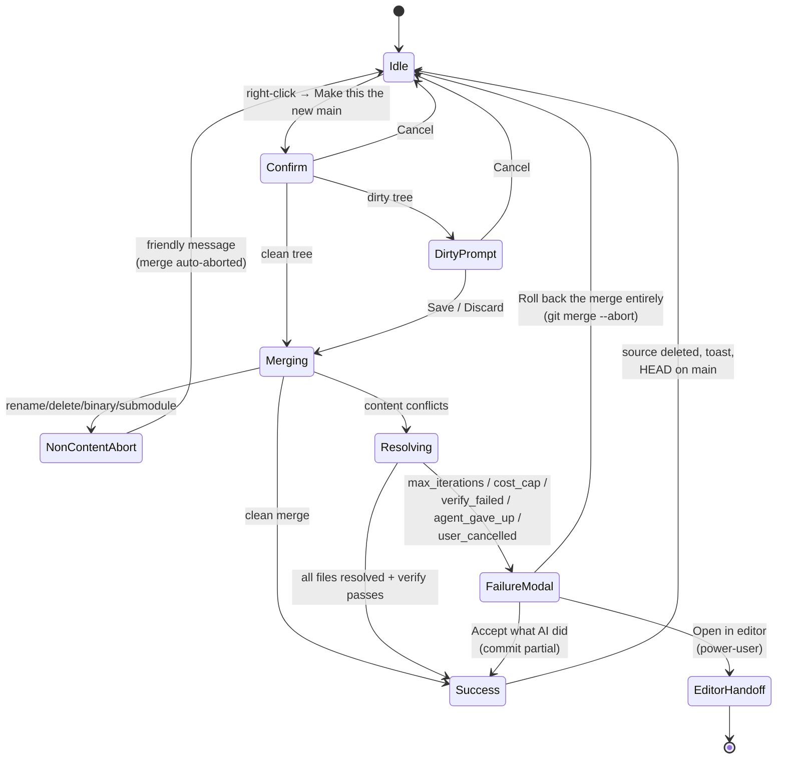

# Branch Management

How users delete and promote saved versions on the timeline, with merge conflicts resolved by an AI agent. The user never sees git terminology, never types a git command, and never sees a conflict marker.

> **Audience:** AI agents and engineers extending or fixing this feature. Read this before touching any file under `src/core/checkpoints/branchOps.ts`, `src/core/conflict-resolver.ts`, or `src/renderer/components/checkpoints/branchOps/`.

## What this feature is

The interactive timeline (feature 010) lets users navigate between saved versions. This feature adds the two missing destructive primitives:

1. **Remove a saved version** — ✕ button on a branch badge.
2. **Make this the new main** — right-click → "Make this the new main".

If the promote merge has line-level conflicts, an AI agent (`runOneShot` invocation) resolves them. The user watches a progress modal and either gets a clean result or hits the failure modal (3 escape options).

## Vocabulary contract — read first

The feature has its own dialect. Internal code uses git terms; **user-visible copy never does**. Every UI string lives in `src/renderer/components/checkpoints/branchOps/copy.ts`.

| Internal (code) | User-visible (UI copy) |
|---|---|
| branch (`dex/*`, `selected-*`) | "saved version" |
| `main` / `master` | "main" (the protected primary version) |
| merge | "combine" |
| merge conflict | "two versions disagree on the same lines" |
| conflict marker / fast-forward / rebase / PR | **never used** |
| delete branch | "remove this version" |
| promote to main | "make this the new main" |

The forbidden words list is enforced by spec FR-028 + SC-004. Two intentional exceptions exist in `copy.ts` (annotated `// allowed:`): `ROLLBACK_MERGE` ("Roll back the merge entirely") and `PROMOTE_NON_CONTENT_CONFLICT` ("…The merge has been undone…"). Don't add more.

## The two namespaces this feature touches

Only Dex-owned branches are deletable / promotable:

| Namespace | Source | Deletable | Promotable |
|---|---|---|---|
| `dex/<date>-<id>` | autonomous run branches | ✅ | ✅ |
| `selected-<ts>` | timeline click-to-jump forks | ✅ | ✅ |
| `main` / `master` | protected primary | ❌ | ❌ (it's the *target*) |
| anything else (`feature/foo`, `lukas/x`, …) | user-owned | ❌ | ❌ |

`isDexOwned()` and `isProtected()` in `branchOps.ts:56-62` are the canonical predicates. Don't fork them.

## Architecture



All mutating IPCs are wrapped in `withLock(projectDir, …)` — no two destructive ops can run on the same project at once.

## Promote state machine



The system is in **exactly one** of these states at any moment. There is no state where the user sees raw conflict markers in the UI.

## Delete flow (US1)

`branchOps.deleteBranch(projectDir, branchName, opts?)` — `src/core/checkpoints/branchOps.ts:166`

1. **Refuse if** branch is protected (`main`/`master`), not Dex-owned, or `state.json.status === "running" && HEAD === branchName`.
2. **Lost-work check** — find commits reachable from `branchName` but not from any other tracked branch (`main`, `master`, `dex/*`, `selected-*`). If any exist and the caller hasn't passed `confirmedLoss: true`, return `{ ok: false, error: "would_lose_work", lostSteps }`. The renderer shows `<DeleteBranchConfirm>` and re-invokes with `confirmedLoss: true` on user confirm.
3. **HEAD handling** — if `branchName` is HEAD, switch to `main` (fallback `master`). If neither exists, return `{ ok: false, error: "no_primary_to_switch_to" }`.
4. **Delete** — `git branch -D <branchName>` (force-delete; the user has already accepted the loss).
5. **Refresh timeline** — renderer re-invokes `checkpoints:listTimeline`.

`deleteBranch` does **not** touch the working tree. Dirty edits are not a blocker — this is intentional and differs from `jumpTo`.

## Promote flow (US2 + US3)

`branchOps.mergeToMain(projectDir, sourceBranch, opts?, rlog?, resolver?)` — `src/core/checkpoints/branchOps.ts:327`

1. **Refusals** — same set as delete, plus: `main`/`master` doesn't exist (`no_primary_branch`), `state.json.status === "running" && HEAD === main` (`main_in_active_run`).
2. **Dirty-tree gate** — if working tree is dirty and `opts.force` is undefined, return `{ ok: false, error: "dirty_working_tree", files }`. Renderer shows `<GoBackConfirm>` (Save / Discard / Cancel) and retries with `force: "save"` or `"discard"`. Save commits dirty changes onto the *current* branch with subject `dex: pre-promote autosave`.
3. **Two-phase merge** —
   - `git checkout main`
   - `git merge --no-ff --no-commit -m "dex: promoted <source> to main" <source>` — always true merge, never fast-forward. The `--no-ff` is what preserves the fork-and-rejoin shape on the timeline.
4. **Classify outcome** via `classifyUnmergedPaths(projectDir)` (`_mergeHelpers.ts`):
   - **Clean** → `git commit --no-edit` → finalize success (delete source branch, toast).
   - **Non-content conflict** (rename/delete, binary, submodule, both-added, both-deleted) → `git merge --abort` → return `non_content_conflict` (UI shows the "AI can't resolve yet" message).
   - **Content conflicts** → hand off to the resolver (next section).
5. **Finalize** — `finalizeMergeSuccess` deletes the source branch and returns the merge SHA. **No tag is created** — the `--no-ff` merge commit on `main` plus the timeline's fork-and-rejoin already encode "promoted from X". Don't add a tag in a future change without re-reading `README.md` from `docs/my-specs/014-branch-management/`.

## AI conflict resolver (US3)

`resolveConflicts(ctx)` — `src/core/conflict-resolver.ts:91`

A plain function over `AgentRunner.runOneShot`. Pure, testable with `MockAgentRunner` + scripted `oneShotResponses`. Does **not** invoke git itself except to run the configured verify command at the end.

### Per-file loop

For each unmerged content-conflict path (in order):

1. **Pre-flight halts** (any of these stop the loop and return failure with a reason):
   - `abortController.signal.aborted` → `user_cancelled`
   - `iterationCounter >= config.maxIterations` → `max_iterations`
   - `costSoFar + prevIterationCost > config.costCapUsd` → `cost_cap` (cost is checked *before* spending — the cap is a hard floor)
2. **Emit** `conflict-resolver:file-start` then `conflict-resolver:iteration`.
3. **Build the prompt** (`buildPromptForFile`) with: file path, last 5 commit subjects on each side, `GOAL.md` truncated to 2KB, explicit "use Edit tool, don't write any other file, don't output explanation".
4. **Invoke** `runner.runOneShot({ allowedTools: ["Read", "Edit"], cwd: projectDir, maxTurns: config.maxTurnsPerIteration, systemPromptOverride: SYSTEM_PROMPT_OVERRIDE })`. The agent edits the file via the Claude SDK's Edit tool.
5. **Verify the file** — re-read it; if conflict markers (`<<<<<<<`, `=======\n`, `>>>>>>>`) are still present, this file failed. v1 gives one chance per file → halt with `max_iterations`.
6. **Record success** and emit `conflict-resolver:file-done`.

### Final verification

After every file resolves, run `config.verifyCommand` (default: `npx tsc --noEmit`) via `execSync`. Failure → `verify_failed`. `null` skips verification.

### Outcome

- Success → `branchOps.mergeToMain` runs `git add -A && git commit --no-edit` → `finalizeMergeSuccess`.
- Failure → `branchOps.mergeToMain` returns `resolver_failed` with the reason and **leaves the merge state in-progress** (index has unresolved/partial state). The renderer's `<ResolverFailureModal>` then drives the next decision via `checkpoints:acceptResolverResult` or `checkpoints:abortResolverMerge`.

### Progress events

All emitted on the existing `orchestrator:event` channel (`webContents.send` → `window.dexAPI.onOrchestratorEvent`):

| Event | When | Fields |
|---|---|---|
| `conflict-resolver:file-start` | before each file | `file, index, total` |
| `conflict-resolver:iteration` | once per file (v1 = 1 iteration/file) | `n, costSoFar, currentFile` |
| `conflict-resolver:file-done` | after each file | `file, ok, iterationsUsed` |
| `conflict-resolver:done` | terminal | `ok, costTotal, reason?` |

Field contract is in `specs/014-branch-management/contracts/conflict-resolver-events.md`.

## Failure escape paths (US4)

When `mergeToMain` returns `resolver_failed`, the renderer opens `<ResolverFailureModal>` with three options:

| Button | IPC | Effect |
|---|---|---|
| **Accept what AI did** | `checkpoints:acceptResolverResult` | `git add -A && git commit --no-edit` over whatever state the agent left (even non-compiling). Then deletes the source branch. User overrides verify failure here. |
| **Roll back the merge entirely** | `checkpoints:abortResolverMerge` | `git merge --abort`. Source branch + main + working tree restored to pre-attempt state. No trace. |
| **Open in editor** (small, bottom-right) | `checkpoints:openInEditor` | Spawns `$EDITOR` (or `xdg-open`/`open`/`notepad`) on the unresolved files. **The only intentional power-user gesture in the feature.** |

The visual hierarchy is intentional — the editor option is small/secondary because it's the only place we *intentionally* expose file editing to the user. Don't promote it.

## `runOneShot` — third agent verb

The conflict resolver needed an ad-hoc Claude invocation that's neither a cycle step nor a build-mode task phase. So `AgentRunner` got a third method:

```ts
interface AgentRunner {
  runStep(ctx: StepContext): Promise<StepResult>;
  runTaskPhase(ctx: TaskPhaseContext): Promise<TaskPhaseResult>;
  runOneShot(ctx: OneShotContext): Promise<OneShotResult>; // 014
}
```

- `ClaudeAgentRunner.runOneShot` — thin wrapper over `query()` with `cwd`, `allowedTools`, `maxTurns`. No structured output, no spec dir, no cycle context.
- `MockAgentRunner.runOneShot` — deterministic stub. Honors a per-test `mock-config.json` entry `oneShotResponses` so tests can script the resolver's behavior across iterations.

`runOneShot` exists for the resolver. Don't overload it for unrelated ad-hoc work without a separate spec.

## Configuration

Per project, in `<projectDir>/.dex/dex-config.json`:

```json
{
  "conflictResolver": {
    "model": null,
    "maxIterations": 5,
    "maxTurnsPerIteration": 5,
    "costCapUsd": 0.50,
    "verifyCommand": "npx tsc --noEmit"
  }
}
```

All fields optional. `model: null` falls back to the project's top-level `model`. `verifyCommand: null` skips verification entirely. Defaults live in `dexConfig.ts:18`.

## Where files live

| File | Role |
|---|---|
| `src/core/checkpoints/branchOps.ts` | `deleteBranch`, `mergeToMain`, `computePromoteSummary`, predicates, lost-work detection |
| `src/core/checkpoints/_mergeHelpers.ts` | `classifyUnmergedPaths`, `gatherCommitSubjects`, `readGoalText`, `finalizeMergeSuccess` |
| `src/core/conflict-resolver.ts` | `resolveConflicts` harness — pure function over `AgentRunner.runOneShot` |
| `src/core/agent/AgentRunner.ts` | `runOneShot` interface + `OneShotContext` / `OneShotResult` types |
| `src/core/agent/ClaudeAgentRunner.ts` | Claude SDK implementation of `runOneShot` |
| `src/core/agent/MockAgentRunner.ts` | Deterministic mock for tests |
| `src/main/ipc/checkpoints.ts` | IPC handlers for `deleteBranch`, `mergeToMain`, `promoteSummary`, `acceptResolverResult`, `abortResolverMerge`, `openInEditor`. All mutators wrapped in `withLock`. |
| `src/main/preload-modules/checkpoints-api.ts` | `window.dexAPI` surface |
| `src/renderer/components/checkpoints/TimelineGraph.tsx` | Renders ✕ button on every Dex-owned badge; opens context menu on right-click |
| `src/renderer/components/checkpoints/BranchContextMenu.tsx` | "Make this the new main" floating menu |
| `src/renderer/components/checkpoints/TimelinePanel.tsx` | Owns all four modals; subscribes to `conflict-resolver:*` events; orchestrates the multi-step promote flow |
| `src/renderer/components/checkpoints/DeleteBranchConfirm.tsx` | Lost-work warning |
| `src/renderer/components/checkpoints/PromoteConfirm.tsx` | Diff summary + confirm |
| `src/renderer/components/checkpoints/ConflictResolverProgress.tsx` | Live progress, cancel button |
| `src/renderer/components/checkpoints/ResolverFailureModal.tsx` | 3-option escape modal |
| `src/renderer/components/checkpoints/branchOps/copy.ts` | All user-visible strings |
| `src/core/__tests__/branchOps.test.ts` | Delete + merge unit tests |
| `src/core/__tests__/conflictResolver.test.ts` | Resolver harness tests with scripted mock |

## Refusal matrix (must-stay-true invariants)

| Attempt | Refused with |
|---|---|
| Delete `main` / `master` | `is_protected` (button not even rendered) |
| Delete `feature/foo` (user branch) | `not_dex_owned` (button not rendered) |
| Delete branch with unique commits, no `confirmedLoss` | `would_lose_work` → modal → user re-tries with confirm |
| Delete current run's branch mid-run | `branch_in_active_run` |
| Delete branch when HEAD = branch and no `main` exists | `no_primary_to_switch_to` |
| Promote `main` itself | menu item disabled |
| Promote user branch | menu item disabled |
| Promote with dirty tree, no `force` | `dirty_working_tree` → `<GoBackConfirm>` |
| Promote during run on `main` | `main_in_active_run` |
| Promote during run on source | `branch_in_active_run` |
| Promote with rename/delete or binary conflict | merge auto-aborted, `non_content_conflict` |
| Resolver hits `maxIterations` | `resolver_failed { reason: "max_iterations" }` |
| Resolver hits `costCapUsd` (checked **before** spending) | `resolver_failed { reason: "cost_cap" }` |
| Resolver SDK throws or returns `finishedNormally: false` | `resolver_failed { reason: "agent_gave_up" }` |
| User clicks Cancel on progress modal | `resolver_failed { reason: "user_cancelled" }` |
| Verify command fails after resolution | `resolver_failed { reason: "verify_failed" }` |

The system is allowed to be in **exactly three states** at any time: clean, mid-promote-with-failure-modal-open, or rolled-back-clean. There is no fourth state with raw conflict markers visible in the UI (FR-031, SC-005).

## Anti-patterns — don't do these

- ❌ **Don't add a `checkpoint/promoted-*` tag** when promote succeeds. The merge commit + fork-and-rejoin already encode the lineage. The spec explicitly removed tag creation.
- ❌ **Don't fast-forward** even when possible. `--no-ff` is mandatory — preserves the timeline shape.
- ❌ **Don't squash** or **rebase**. v1 is one strategy: true merge.
- ❌ **Don't push to remote.** Out of scope — separate spec.
- ❌ **Don't widen the deletable set** beyond `dex/*` + `selected-*`. User branches stay safe by construction.
- ❌ **Don't let the resolver edit any file other than the conflicting one.** The system prompt and `allowedTools: ["Read", "Edit"]` enforce this; don't relax.
- ❌ **Don't auto-retry a failed resolver iteration.** v1 gives one chance per file; failure → human escape modal.
- ❌ **Don't write `merge`, `branch`, `conflict marker`, `rebase`, `fast-forward`, or `PR` in any user-visible string.** The two grandfathered exceptions are annotated in `copy.ts`.
- ❌ **Don't add a CLI surface.** IPC is the only interface in v1.
- ❌ **Don't bypass `withLock`** in any new IPC handler that mutates state.

## Out of scope — natural follow-ups (own spec)

- Push promoted main to remote / open a GitHub PR
- Bulk delete UI / "Clean up old branches" panel
- Squash / rebase / fast-forward strategy toggles
- Resolver model swap mid-resolution (e.g. Sonnet → Opus on failure)
- Per-file live diff preview during resolution
- Headless / scriptable invocation (CLI)
- Resolving rename/delete, binary, or submodule conflicts

## Pointers

- Design rationale, voice/copy table, implementation order: `docs/my-specs/014-branch-management/README.md`
- Functional requirements (FR-001 … FR-031), success criteria, edge cases: `specs/014-branch-management/spec.md`
- Resolver event contract: `specs/014-branch-management/contracts/conflict-resolver-events.md`
- Manual verification (DoD checklist): the "Verification (DoD)" section of `docs/my-specs/014-branch-management/README.md`
